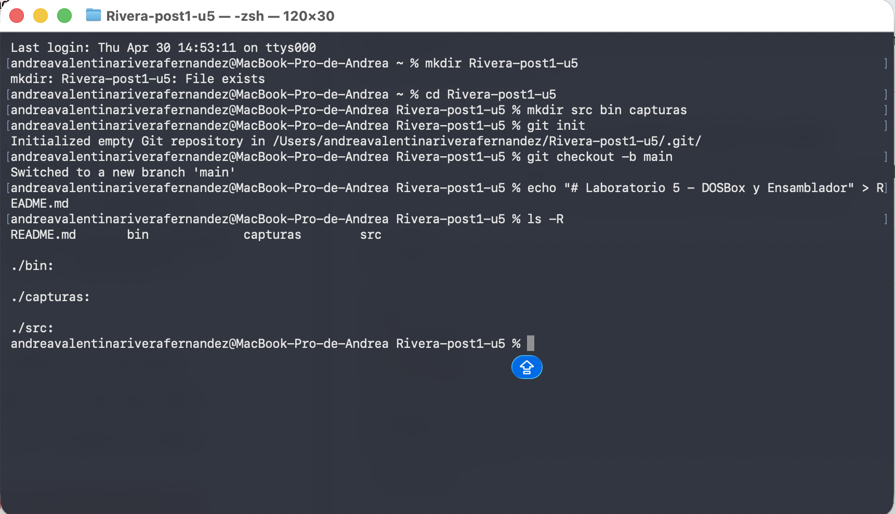
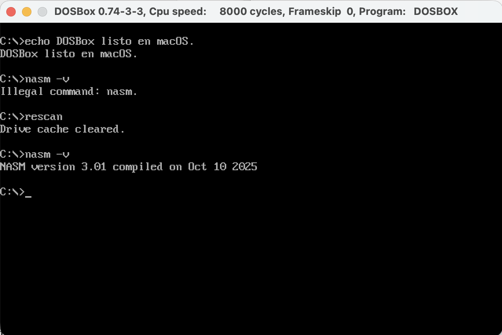
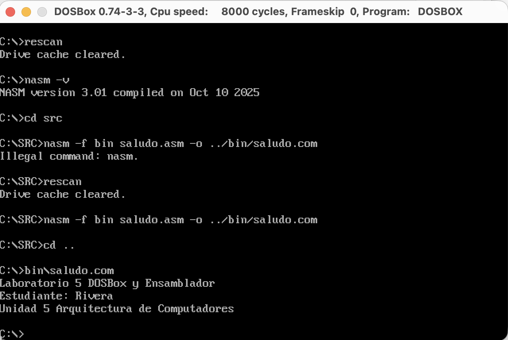
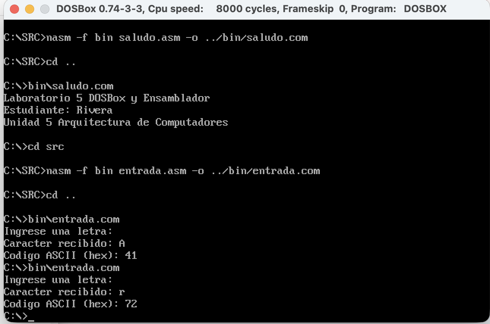
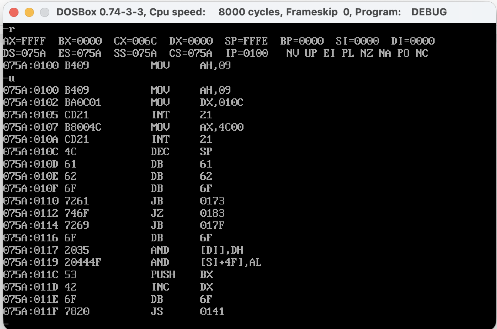

# Laboratorio 5: Emuladores y Virtualización - Entorno DOSBox

## Información del Estudiante
* **Nombre:** Andrea Valentina Rivera Fernández
* **Código:** 1152444
* **Institución:** Universidad Francisco de Paula Santander (UFPS)
* **Materia:** Arquitectura de Computadores
* **Unidad:** 5
* **Año:** 2026

## Descripción del Proyecto
Este laboratorio consiste en la configuración de un entorno de desarrollo funcional en **DOSBox** para el lenguaje ensamblador x86. Se implementaron programas utilizando el ensamblador **NASM** y se verificó el flujo de datos y registros mediante la herramienta **DEBUG** de DOS.

## Entorno de Trabajo
* **Sistema Operativo Anfitrión:** macOS
* **Emulador:** DOSBox 0.74-3
* **Ensamblador:** NASM versión 2.15.05 (para DOS)
* **Depurador:** DEBUG.EXE
* **Gestión de Versiones:** Git & GitHub

## Estructura del Repositorio
Siguiendo los lineamientos de la guía, el repositorio se organiza de la siguiente manera:
* `src/`: Contiene los archivos fuente de los programas (`saludo.asm`, `entrada.asm`).
* `bin/`: Contiene los ejecutables generados en formato `.com`.
* `capturas/`: Evidencias de los checkpoints realizados.
* `dosbox.conf`: Archivo de configuración personalizada para el montaje de unidades en macOS.

---

## Checkpoints y Resultados

### Checkpoint 1: Preparación del Directorio
Se creó la estructura de carpetas necesaria y se inicializó el repositorio Git localmente.

### Checkpoint 2: DOSBox Operativo con NASM
Configuración exitosa del archivo `dosbox.conf`. Se verificó la disponibilidad de NASM en el entorno emulado con el comando `nasm -v`.

### Checkpoint 3: Programa 1 - Salida de Texto (saludo.com)
Implementación de la interrupción **INT 21h** (función `09h`) para mostrar en pantalla los datos del estudiante y del laboratorio.
* **Comando de ensamble:** `nasm -f bin src/saludo.asm -o bin/saludo.com`

### Checkpoint 4: Programa 2 - Entrada y Eco (entrada.com)
Desarrollo de un programa que captura un carácter mediante la función `07h` de la interrupción `21h` y realiza el eco del carácter junto con su representación hexadecimal (ASCII).

### Checkpoint 5: Verificación con DEBUG
Sesión de depuración donde se analizó el programa `saludo.com`. Se utilizaron los comandos:
* `-u`: Para el desensamblado de instrucciones.
* `-t`: Para la ejecución paso a paso (trace), observando los cambios en los registros `AX` y `DX`.

---

## Conclusiones
1. El uso de emuladores como **DOSBox** permite estudiar arquitecturas legacy (x86 16 bits) de manera segura y controlada en sistemas modernos como macOS.
2. La comprensión de las interrupciones de DOS (`INT 21h`) es fundamental para la interacción básica entre el software y el sistema operativo a bajo nivel.
3. El manejo de registros y la observación de los mismos mediante **DEBUG** refuerza la teoría sobre el ciclo de instrucción y el funcionamiento interno de la CPU.
